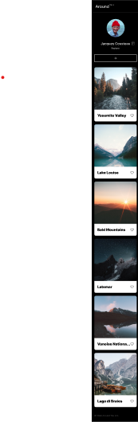

# Project 3: Around The U.S.

The Intention for this project is to portray how the elements of the website will react based upon different screen sizes. This project introduces media quieries to do so.

## Project Features

-Semantic HTMl
-BEM Methodology
-Flexbox and Grid
-Responsive design
-CSS media quieres

## Project Website

https://xrtvr.github.io/se_project_aroundtheus/

## Figma

[Link to the project on Figma](https://www.figma.com/file/Es8zZP3ARGH9JGcw60i3OD/Sprint-3_-Around-the-US?type=design&node-id=0%3A1&mode=design&t=EfVpDga9MFR5QfmQ-1)

## Images

## Video

[Link to Video](https://www.loom.com/share/0729bc69d50c4fa38a39c0b9985e7a70?sid=aa105278-79c1-4737-9924-cef729183825)
